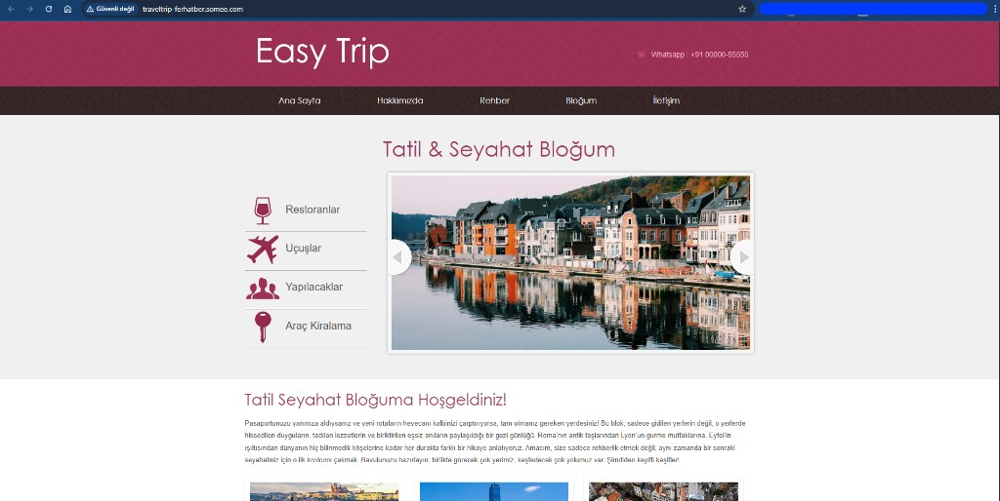
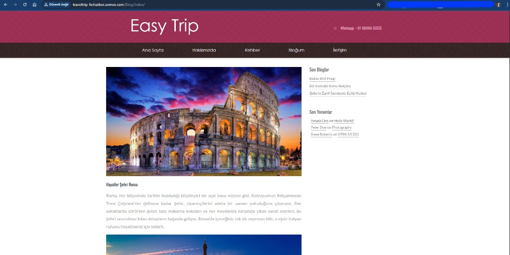
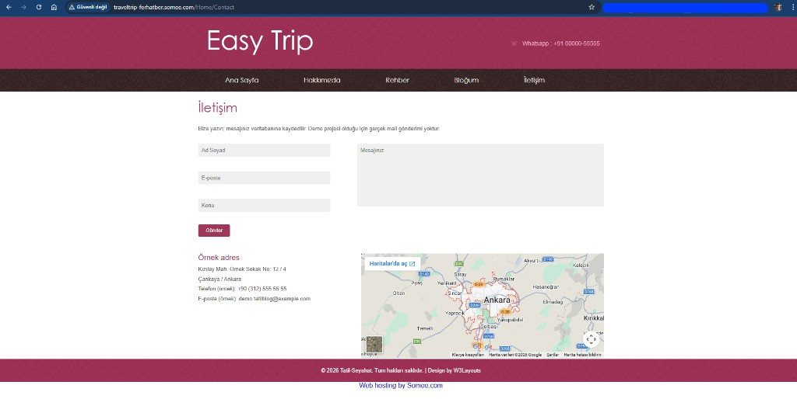
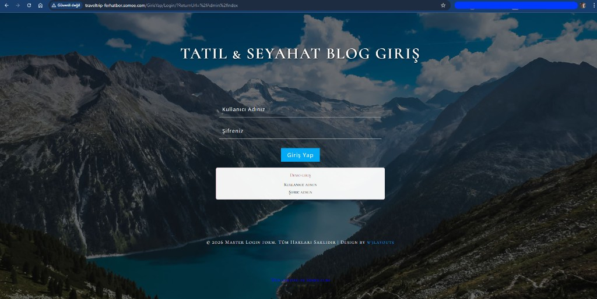
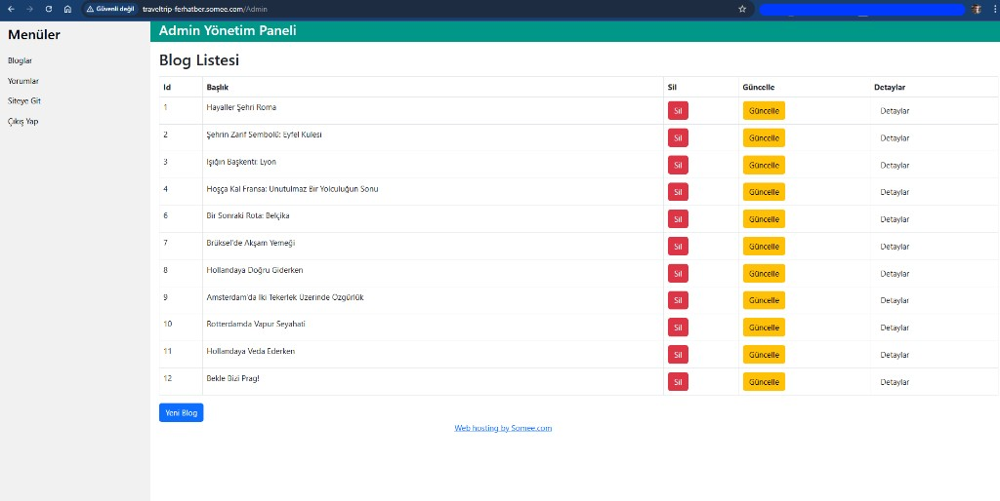
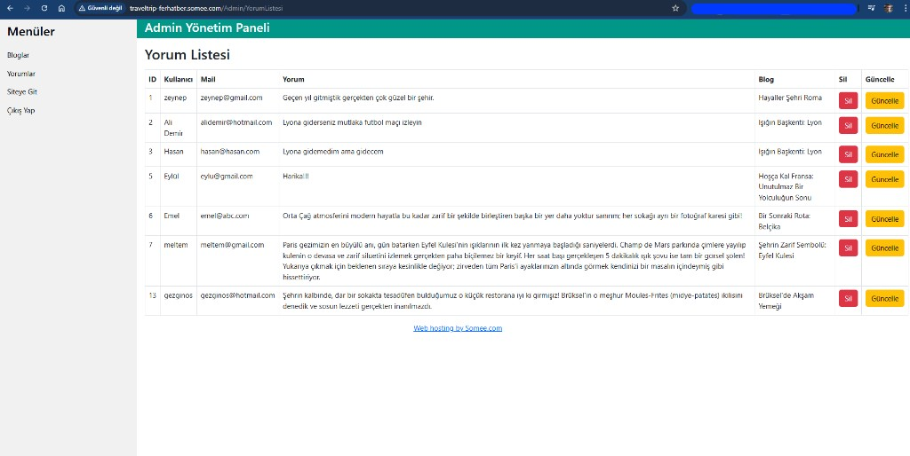

# TravelTripProje

ASP.NET MVC 5 ile geliştirilen, gezi yazıları paylaşımı ve yönetim paneli içeren bir seyahat blog projesi.

## Canli Yayin

- Site linki: [traveltrip-ferhatber.somee.com](http://traveltrip-ferhatber.somee.com/)

## Proje Ozeti

Bu proje junior seviyede ASP.NET MVC mimarisini ogrenmek, Entity Framework ile veritabani islemleri yapmak ve bir uygulamayi canli ortama deploy etmek icin gelistirildi.

Uygulama tarafinda ziyaretciler:
- Blog iceriklerini listeleyebilir
- Blog detaylarini gorebilir
- Yorum birakabilir
- Iletisim formu gonderebilir
- Rehber sayfasinda kategorik gezi iceriklerine ulasabilir

Admin tarafinda:
- Giris islemi ile yetkilendirilmis erisim bulunur
- Blog CRUD islemleri yapilabilir
- Yorum listesi ve yorum guncelleme ekranlari kullanilabilir

## Admin Paneli

Admin paneli, icerik yonetimini tek yerden yapabilmek icin tasarlandi. `Authorize` korumasi ile admin girisi yapilmadan yonetim ekranlarina erisim saglanamaz.

Admin panelinde su moduller bulunur:
- Blog ekleme, guncelleme ve silme (CRUD)
- Tum yorumlari listeleme
- Yorum duzenleme ve moderasyon
- Yonetim odakli ayri layout (`_AdminLayout`) ile sade arayuz

Bu yapi sayesinde public taraftaki blog deneyimi ile yonetim operasyonlari birbirinden ayrilarak daha duzenli bir mimari elde edilir.

## Kullanilan Teknolojiler

- C#
- ASP.NET MVC 5
- Razor View Engine
- Entity Framework 6 (Code First yaklasimi)
- MS SQL Server
- HTML5 / CSS3 / JavaScript
- Bootstrap
- IIS / Somee hosting

## Bu Projede Ogrendiklerim

- MVC katmanli yapi (Controller-View-Model ayrimi)
- Route yapisi ve default route yonetimi
- Partial view kullanimi
- Form post islemleri ve model binding
- Anti-forgery token ile temel guvenlik
- Authorize attribute ile admin yetkilendirme
- Entity Framework ile CRUD ve iliskili veri cekme
- Web.config uzerinden connection string yonetimi
- Publish output ve FTP ile deploy sureci
- Canli ortamda hata ayiklama (customErrors, deploy farklari)

## Proje Yapisi (Kisa)

- `TravelTripProje/Controllers`: Is akisi ve sayfa yonetimi
- `TravelTripProje/Models/Siniflar`: Entity modelleri + DbContext
- `TravelTripProje/Views`: Razor gorunum dosyalari
- `TravelTripProje/App_Start`: Route, filter ve bundle ayarlari
- `TravelTripProje/web`: Tema varliklari (css/js/images)

## Kurulum (Local)

1. Repoyu klonlayin.
2. `TravelTripProje.sln` dosyasini Visual Studio ile acin.
3. NuGet paketlerini restore edin.
4. `TravelTripProje/Web.config` icinde `connectionStrings` altindaki `Context` baglantisini kendi SQL Server bilginize gore guncelleyin.
5. Package Manager Console uzerinden migration/DB olusturma adimlarini tamamlayin (kullanim tercihinize gore).
6. Projeyi IIS Express veya Local IIS ile calistirin.

## Canliya Alma Notu

Somee gibi paylasimli hostlarda:
- `system.webServer` altinda extensionless URL handler ayarlari dogru olmali
- Connection string SQL Authentication ile duzenlenmeli
- Uzak veritabani adi ile `Initial Catalog` birebir eslesmeli

## Gelistirme Fikirleri

- Arama ve filtreleme
- Pagination yapisi
- Admin panelinde dashboard metrikleri
- Rol bazli yetkilendirme
- Unit test entegrasyonu

## Ekran Goruntuleri

### Public Sayfalar

- Ana Sayfa  
  

- Blog Listesi  
  

- Iletisim Sayfasi  
  

### Admin Paneli

- Admin Giris Ekrani  
  

- Blog Yonetim Listesi  
  

- Yorum Yonetim Listesi  
  

## Lisans

Bu proje ogrenme amacli hazirlanmistir.
